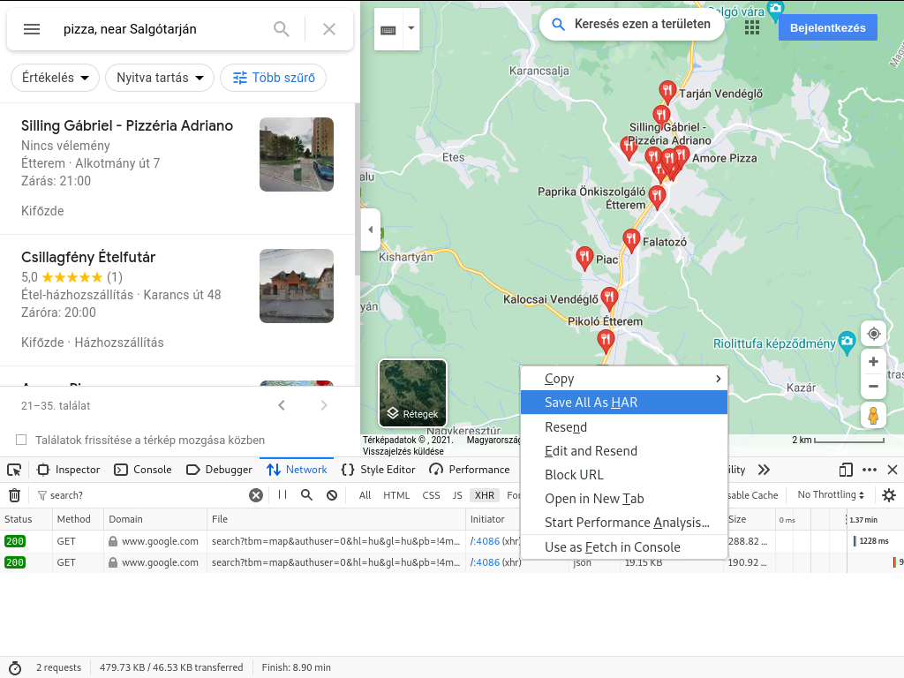

# gmhar

With some care, you can collect Google Maps business data using the Firefox browser development tool. (Network / XHR tab.) See the picture below!




When you have finished crawling, you should then **filter** the XHR responses to the *search?* (or search?tbm ) keyword.
Then save everything to .har format. (*"Save All As HAR"*)

Finally, you can use this Python script to extract information from the *.har* file.

This script has its own help:

```
$ python gmhar.py --help
usage: gmhar.py [-h] [--same] har [outfile]

Process Google Maps HAR to .csv .

positional arguments:
  har         Input HAR file name for processing. REQUIRED.
  outfile     If not specified, the output will be sent to STDOUT.

optional arguments:
  -h, --help  show this help message and exit
  --same, -s  The name of the output file will be the same as the name of the
              input file, but with the extension .csv.
```

The idea comes from viktor0011: https://github.com/viktor0011/Google-Maps-scrape  His video: https://www.youtube.com/watch?v=9-wuyhMkl9E
